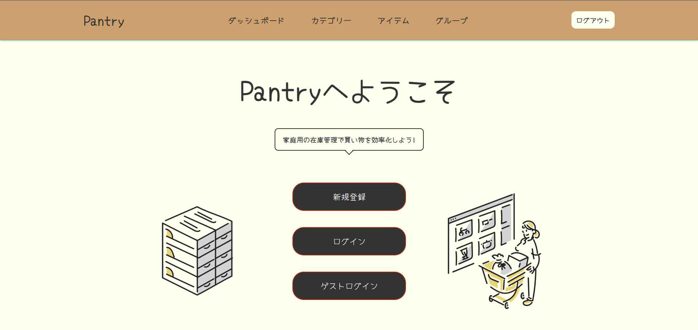
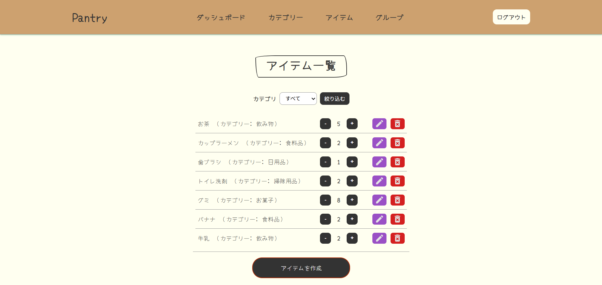
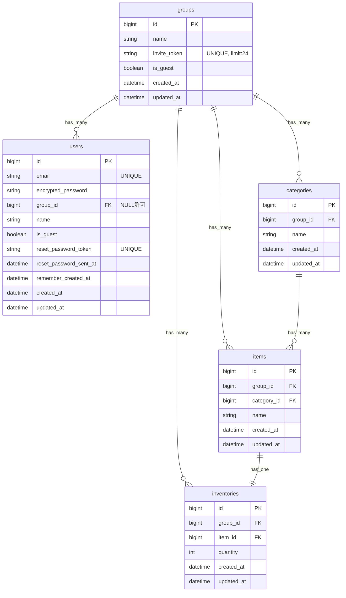

# Pantry - 買い忘れや買い過ぎを防ぎ、買い物を効率的にする家庭用の在庫管理アプリ

## 1. サービス概要
- 「Pantry」は、家庭の在庫を記録し、毎日の買い物の無駄を無くすためのウェブアプリです。
- アプリ内でグループを作成して家庭の在庫をグループメンバーと共有することが出来ます。
- シンプルなUIで簡単に在庫を登録でき、カテゴリ別に在庫を確認できるのが特徴です。

## 2. サービス画像

## 3. サービスのURL
- https://pantry-app-skt-b67dfc144a7d.herokuapp.com/

## 4. 開発背景・目的
- このアプリは、母が買い物の後に「買い忘れた」「まだ在庫があるのに購入してしまった」と困っている様子を見て、そうした課題を解決できないかと考えたことをきっかけに開発しました。

- また、必要なものを買って帰った際に、家族も同じものを買ってきていたことがありました。
この経験から、買い物中に在庫数を確認できれば、重複した買い物を防ぎ、無駄なく買い物ができるのではないかと考えました。
そのために、グループで在庫情報を共有できる機能を開発しました。

- 家庭内の子どもから高齢の方まで幅広い年代の方にとって使いやすいように、操作はシンプルにし、親しみやすく温かみのあるデザインに仕上げました。

## 5. 機能
### 認証機能
- 新規登録 : メールアドレスとパスワードでアカウントを作成
- ログイン : 登録済みのユーザー情報でログイン
- ゲストログイン : 登録なしですぐにアプリを操作可能

### ダッシュボード
- グループ情報(所属ユーザー / 招待トークン)の表示
- グループ作成導線 : グループ未所属時に作成画面へ遷移
- グループ参加導線 : グループ未所属時に招待コード入力画面へ遷移

### グループ機能
- グループ作成 : 新規グループを作成
- グループ参加 : 招待コードで既存グループへ参加
- グループ編集 : グループ名を更新
- グループ退会 : 所属グループから退会

### カテゴリ機能
- カテゴリ作成 : グループ内にカテゴリを追加
- カテゴリ編集 : カテゴリ名を更新
- カテゴリ削除 : グループ内のカテゴリを削除

### アイテム機能
- アイテム作成 : 商品名とカテゴリを登録し、アイテムを作成
- アイテム編集 : 登録済みアイテム情報を更新
- 在庫数更新 : アイテムの在庫数を増減して保存
- アイテム削除 : 登録済みアイテムを削除

## 6. 主な使用技術
### フロントエンド
- HTML / CSS/ JavaScript
- Hotwire (Turbo, Stimulus)

### バックエンド
- Ruby 3.3.3
- Ruby on Rails 7.2.3
- PostgresSQL (データベース)
- Devise (認証)

### インフラ・開発環境
- Heroku (デプロイ)
- CircleCI (CI/CD)
- Docker (開発環境)
- Git / GitHub (バージョン管理)

### テスト・品質管理
- RSpec (テスト)
- Rubocop (静的解析)

## 7. ER図

## 8. 今後の展望
### 短期的な目標
- 異常系のテストの追加
- ユーザーアイコンの実装
- レスポンシブデザインの微調整

### 長期的な目標
- アイテム詳細の実装
  - アイテム画像を登録
  - 型番 / 品番 / 容量 / サイズ / 色
- チャット機能の実装
  - グループチャット
- 通知機能の実装
  - 在庫数の増減をグループメンバーに通知
  - チャット通知
- アカウント情報の再設定機能の実装
